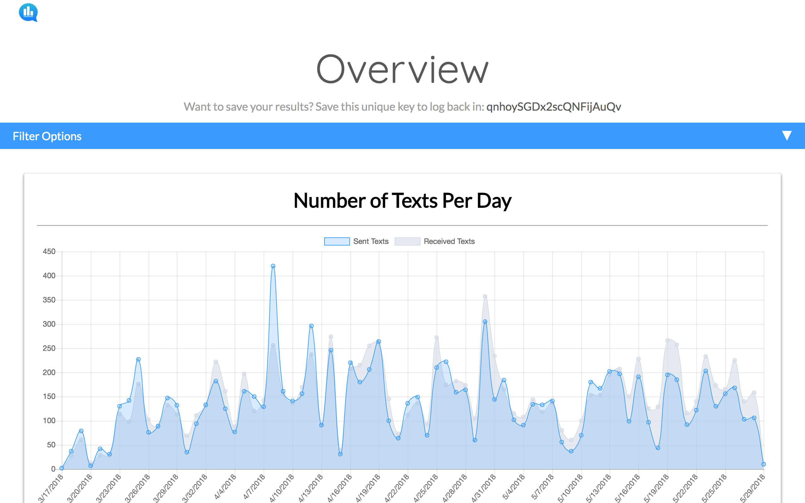
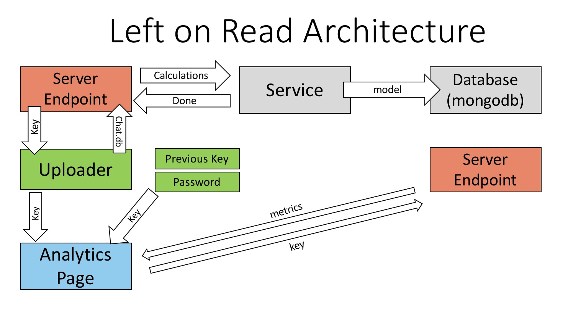

# Left On Read Server

A web iMessage Analyzer. Analyze your texts. Learn who your friends are.

This is the server repo for Left On Read,  a website that provides statistical data about your texting habits in iMessage conversations. The client repo can be found [here.](https://github.com/alexdanilowicz/client-leftonread)

## What is Left On Read?

Left On Read provides statistical data about your texting habits. 

It gives you the platform to quickly and effortlessly analyze your texts and discover new insights about yourself, your contacts, and your relationships. With comprehensive analytical tools, beautiful and intuitive visuals, and agile filtering options, we give you complete control to manipulate and examine your data, your way. Daily texting history, top 5 words, sentiment analysis, and so much more - all available at your fingertips.

What word do you text the most? Favorite emoji? Top 5 friends? Do you text people more than they text you? Left On Read answers these questions.



What word do you text the most? Favorite emoji? Top 5 friends? Do you text people more than they text you? Left On Read answers these questions.


We don't tell the story. We let your data tell the story.

---

Again, you are reading the **server** repo and README.

## Architecture



The backend for Left on Read contains three main services: 1) a vcf parser for the optional contacts file, 2) an SQL Query that handles parsing all uploaded text messages, and 3) a MongoDB collection database that creates new instances for each user, and also stores the SQL output within our date-text documents and allows for efficient querying.

### Endpoints

The notable endpoints our server provides are:

```
/instance
- POST: Create a new instance with given parameters
- GET: Get an instance associated with given key

/upload
- POST: Uploading necessary form data to create a new instance

/metric
- POST: Getting the calculated metric value for a given metric and instance key

/allnumbers
- POST: Getting the numbers to display in the filter bar for a given instance

/wordfilter
-	POST: Designated route to query for specific word counts
```

### Instances
We decided to associate each run, or each upload, with a unique instance key. The instance key is used to identify all data associated with a specific instance, and knowledge of an instance key is what grants permission. We optionally allow users to set a password for a second layer of proection. The passwords are of course encrypted in Mlab. All instances are located in the ````instance```` collection.

### File uploading
To deal with uploading two rather large files, we expect the upload via Javascript's native Form Data object, and use the ````multer```` middleware library to automatically grab this file for us. Upon upload, we assign the file a random, uniquely generated instance key. 

### SQL Querying

The SQL Querying takes the provided `chat.db` file from the user and parses it by date to populate the date-text model in the MongoDB database. A high-level overview of the procedure follows:

- defines SQL query
  - joins 'message' and 'handle' tables
  - contains date, text, id (phone number), and is\_from\_me
  - sorted by phone number, then date
  - accounts for whether dates are formatted by nanosecond (high sierra) or second (before high sierra)
- sqlite3 library provides db.all
  - runs query
  - rows.forEach loops through each entry in the resulting table
    - parses each text word by word
    - calculates word frequencies
    - associates words with sentiment categories
    - calculates average lengths sent and received
  - creates JSON formatted string with these fields

### MongoDB

The MongoDB server stores two collections. One is of the user instances, which are unique to each individual user of Left On Read and securely stores their metrics outputs, accessible only with the correct password and key combination.

Date-Text Schema:

```
javascript
const DateTextSchema = new Schema({
  // User info
  key: String,

  // Text info
  date: Date,
  display: String,
  sentWords: [String],
  sentFrequency: [Number],
  recWords: [String],
  recFrequency: [Number],


  // General overall analytics
  avgLengthReceived: Number,
  receivedTexts: Number,

  avgLengthSent: Number,
  sentTexts: Number,

  sentSentimentLove: Number,
  recSentimentLove: Number,
  sentSentimentHappy: Number,
  recSentimentHappy: Number,
  sentSentimentAnger: Number,
  recSentimentAnger: Number,
  sentSentimentStress: Number,
  recSentimentStress: Number,
  sentSentimentSocial: Number,
  recSentimentSocial: Number,

}
```

We also leverage a variety of MongoDB queries and aggregations in order to compile or sort the data for a specific metric, specifically `$match` and `$group` in the aggregation pipeline to filter the results. Filter data or specific queries are passed in within `req.body`, and we return the necessary data for each graph in the appropriate `res` upon aggregation. Available queries from our controller include:

* getAllNumbers
* getTotalTexts
* getRangeTexts
* getTopFriends
* getTopWords
* getSentiments
* wordFilter
* getAvgLength
* sentimentOverTime
* reconnectWithFriends

# How to get project up and running?

## Setup

To setup the project dev environment, first clone this server repo. Then clone the client repo.

While in the root, run `yarn` to install all packages and dependencies.

To run the server with hot reloading, you can use:

`yarn dev`

You should see this output:

```
bash
yarn run v1.7.0
$ nodemon src/server.js --exec babel-node
[nodemon] 1.17.3
[nodemon] to restart at any time, enter `rs`
[nodemon] watching: *.*
[nodemon] starting `babel-node src/server.js`
```

The server is configured to run on port 9090.

You'll then need to run the client repo.

## Deployment

Looking to make changes? Please push your changes to your respective branch and make a pull request.

Upon review and a successful merge to `master`, the code will automatically be deployed to our Heroku server at [https://left-on-read.herokuapp.com/api](https://left-on-read.herokuapp.com/api)


## Authors

Alexander Danilowicz, Teddy Ni, Branden Pellowski, Thomas Kim, Weiling Huang, Justin Luo

Contact the team at: alex.19@dartmouth.edu

## Acknowledgments

* Thank you to [Tim Tregubov](https://home.dartmouth.edu/faculty-directory/tim-tregubov) for guidance and wisdom.
* Course materials from [CS52 Dartmouth](http://cs52.me/).
* Express [Documentation](https://expressjs.com/en/guide/routing.html)
* Mongoose [Documentation](http://mongoosejs.com/docs/api.html#)
* [bcryptjs](https://www.npmjs.com/package/bcryptjs)
